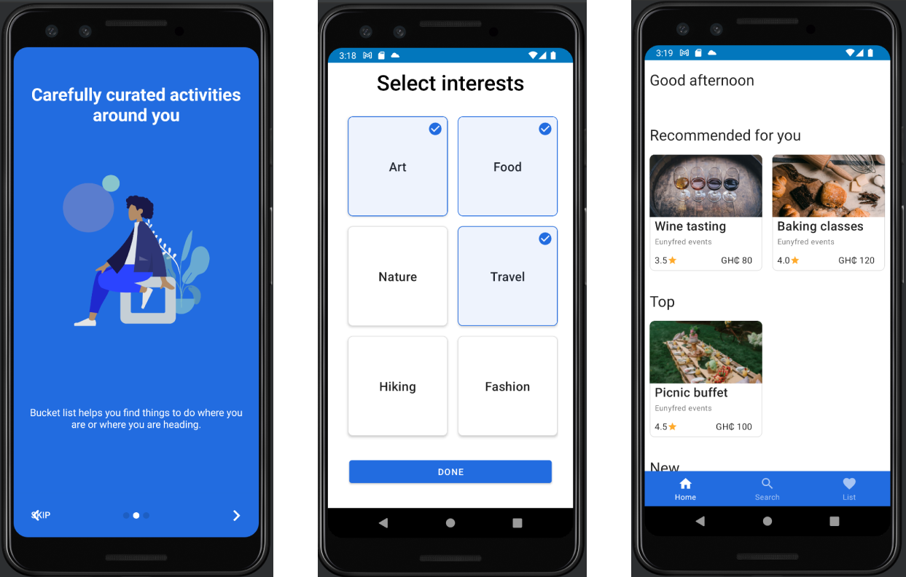
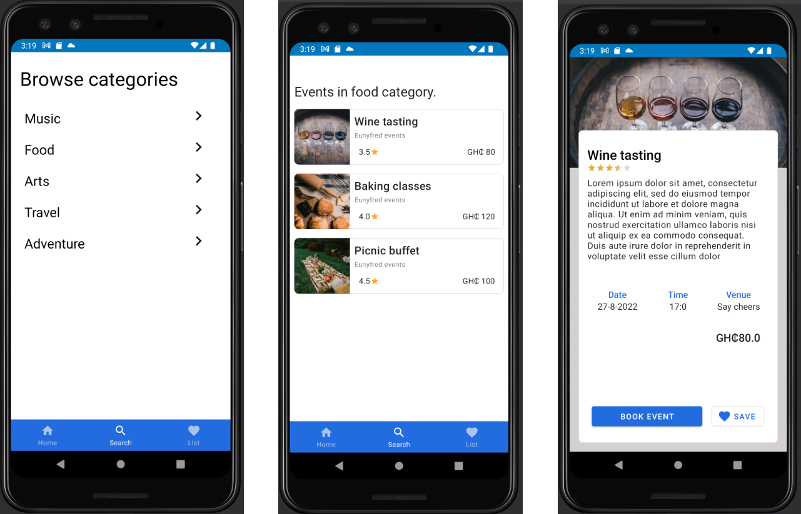
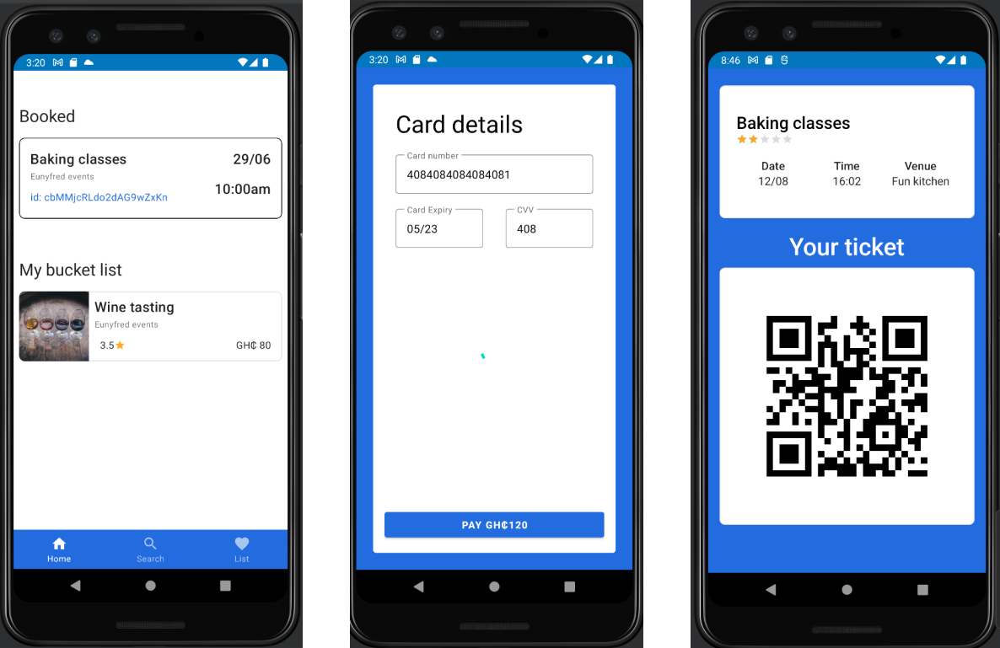

# BucketList
An app that helps people find fun things to do.

## Description
This is an attempt at implementing the results of a capstone project carried out by 
[Eunifred Asante](https://www.linkedin.com/in/eunifred-asante-bediako-a90627189/)
who used [IBM's Design Thinking Framework](https://www.ibm.com/design/thinking/page/framework) 
tool in solving the problem of finding leisure activities to do, based on their interests. 
The results is a platform composed of two android apps; [BucketList](https://github.com/KAbaidoo/BucketList)
to find activities and [BucketList curators app](https://github.com/KAbaidoo/bucketList-curator) of activities.
The app enables users to onboard, find interesting activities and make bookings for these events. 
The app uses [Firebase](https://firebase.google.com/docs) as a backend including:
[Authentication](https://firebase.google.com/docs/auth) to signup and validate users, 
[Cloud Firestore](https://firebase.google.com/docs/firestore) for the main database 
and [Cloud Storage](https://firebase.google.com/docs/storage) for file storage. 
QR encoding was implemented with [Zebra Crossing](https://zxing.github.io/zxing/library) library.
Payments was implemented with [PayStack](https://paystack.com/gh/).

The app works on phones running Android version 5.0 (API level 21) and above. 

Some of the features that was successfully implemented are listed below.

###Features
- Signup and selection of interests.
- Recommendations based on interests as well as top and recently published events.
- Add activity to a wishlist (BucketList).
- Book an event and make payment.
- Generation of QR code based ticket for the event.

## Installation
Clone this repository and import into **Android Studio**
```
git clone https://github.com/KAbaidoo/BucketList.git

```
### Generating signed APK
From Android Studio:
1. Build menu
2. Generate Signed APK...
3. Fill in the keystore information (you only need to do this once manually and then let Android Studio remember it).

## Usage
1. Signup
2. Select interests
3. Find event.
4. Book event or save for later.
5. Use QR code ticket at event.

### Screenshots










